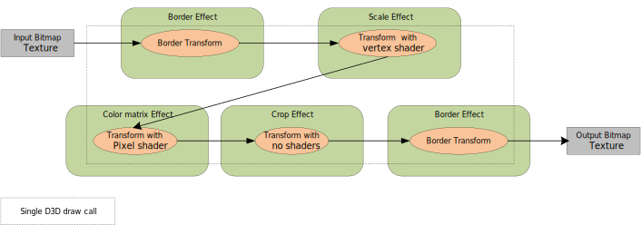
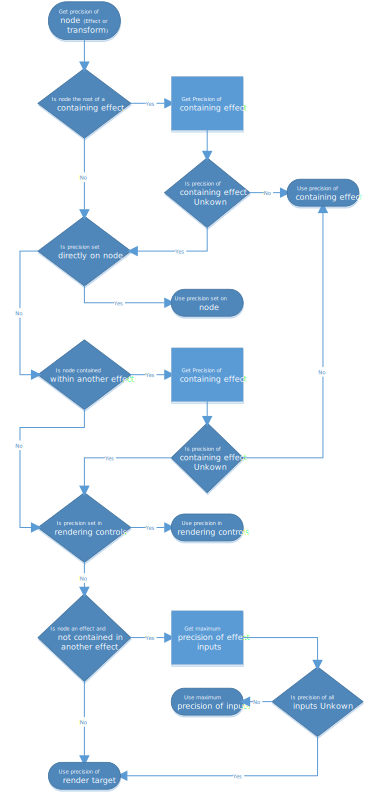

# Effect precision and clamping

Care must be taken while rendering effects using Win2D to achieve the desired level of quality and predictability with respect to numerical precision.

You need to understand these details if:
1. Your effect graph relies on high numerical precision or colors outside of the [0, 1] range, and you want to make sure these will always be available.
2. Or your effect graph relies on the rendering implementation to clamp intermediate colors to the [0, 1] range, so you must ensure this clamping always occurs.

Win2D often divides an effect graph into sections, and renders each section in a separate step. The output of some steps may be stored in intermediate Direct3D textures which by default have limited numerical range and precision. Win2D makes no guarantees about if or where these intermediate textures are used. This behavior may vary according to GPU capabilities as well as between Windows versions.

In Windows 10, Win2D uses fewer intermediate textures due to its use of [shader linking](https://msdn.microsoft.com/library/windows/desktop/dn879810). Win2D may therefore produce different results with default settings than in prior Windows releases. This primarily affects scenarios where shader linking is possible in an effect graph, and that graph also contains effects that produce extended-range output colors.

## Overview of effect rendering and intermediates

To render an effect graph, Win2D first finds the underlying graph of "transforms", where a transform is a graph node used within an effect to apply a specific processing operation. Each image effect may internally be implemented using one or several transforms. There are different types of transforms, including those which provide Direct3D shaders for Direct2D to use.

For example, Win2D may render an effect graph as follows:


Win2D looks for opportunities to avoid using intermediate textures. This logic is opaque to applications, and may reduce the number of intermediate textures used. For example, the following graph can be rendered by Win2D using one Direct3D draw call and no intermediate textures:



Prior to Windows 10, Win2D would always use intermediate textures if multiple pixel shaders were used within the same effect graph. Most built-in effects that simply adjust color values (for example, Brightness or Saturation) do so using pixel shaders.

In Windows 10, Win2D may now avoid using intermediate textures in such cases. It does this by internally linking adjacent pixel shaders. For example:


Note that not all adjacent pixel shaders in a graph may be linked together, and therefore only certain graphs will produce different output on Windows 10. For full details see [Effect Shader Linking](https://msdn.microsoft.com/library/windows/desktop/dn879810). The primary restrictions are:

- An effect will not be linked with effects consuming its output, if the first effect is connected as an input to multiple effects.
- An effect will not be linked with an effect set as its input, if the first effect samples its input at a different logical position than its output. For example, a `ColorMatrix` effect might be linked with its input, but a `Convolution` effect will not be.

## Built-in effect behavior

Many built-in effects may produce colors outside of the [0, 1] range in unpremultiplied space, even when their input colors are within that range. When this happens, such colors may be subject to numerical clamping. Note that it's important to consider the color range in unpremultiplied space, even though built-in effects typically produce colors in premultiplied space. This ensures that colors stay within range, even if other effects subsequently unpremultiply them.

Some of the effects which emit these out-of-range colors offer a `ClampOutput` property. These include:

- `ColorMatrix`
- `ArithmeticComposite`
- `Convolve`
- `Transfer` effects

Setting the `ClampOutput` property to true on these effects ensures a consistent result will be achieved regardless of factors such as shader linking. Note that clamping occurs in unpremultiplied space.

Other built-in effects may also produce output colors beyond the [0, 1] range in unpremultiplied space, even when their color pixels (and `Color properties if any) are within that range. These include:

- `Transform` and `Scale` effects (when the `InterpolationMode` property is `Cubic` or `HighQualityCubic`)
- Lighting effects
- `EdgeDetection` (when the `OverlayEdges` property is `true`)
- `Exposure`
- `Composite` (when the `Mode` property is `Add`)
- `Saturation`
- `Sepia`
- `TemperatureAndTint`

## Forcing numerical clamping within an effect graph

While using effects listed above which do not have a `ClampOutput` property, applications should consider forcing numerical clamping. This can be done by inserting an additional effect into the graph that clamps its pixels. A `ColorMatrix` effect may be used, with its `ClampOutput` property set to `true`.

A second option to achieve consistent results is to request that Win2D use intermediate textures which have greater precision. This is described below.

## Controlling precision of intermediate textures

Win2D provides a few ways to control the precision of a graph.

Before using high precision formats in Win2D, applications must ensure they are supported sufficiently by the GPU. To check this, use [`IsBufferPrecisionSupported(CanvasBufferPrecision)`](https://microsoft.github.io/Win2D/WinUI2/html/M_Microsoft_Graphics_Canvas_CanvasDevice_IsBufferPrecisionSupported.htm).

Applications may create a Direct3D device using WARP (software emulation) to ensure that all buffer precisions are supported. This is recommended in scenarios such as applying effects to a photo while saving to disk. Even if Win2D supports high precision buffer formats on the GPU, using WARP is recommended in this scenario on feature level 9.X GPUs, due to limited precision of shader arithmetic and sampling on some low-power mobile GPUs. To use software rendering, specify `ForceSoftwareRenderer = true` on your Win2D XAML controls or when creating your `CanvasDevice`.

In each case below, the requested precision is actually the minimum precision Win2D will use. Higher precision may be used if intermediates are not required. Win2D may also share intermediate textures for different parts of the same graph or different graphs entirely. In this case Win2D uses the maximum precision requested for all involved operations.

### Precision selection from the drawing session

The simplest way to control the precision of Win2D's intermediate textures is to use the [`EffectBufferPrecision`](https://microsoft.github.io/Win2D/WinUI2/html/P_Microsoft_Graphics_Canvas_CanvasDrawingSession_EffectBufferPrecision.htm) property. This controls the precision of all intermediate textures, as long as a precision is not also set manually on effects directly.

```csharp
if (canvasDevice.IsBufferPrecisionSupported(CanvasBufferPrecision.Precision32Float))
{
    drawingSession.EffectBufferPrecision = CanvasBufferPrecision.Precision32Float;
}
```

### Precision selection from inputs and render targets

Applications may also rely on the precision of the inputs to an effect graph to control the precision of intermediate textures.

The precisions of inputs to effects are propagated through the graph to select the precision of downstream intermediates. Where different branches in the effect graph meet, the greatest precision of any input is used.

The precision selected based on a Win2D bitmap is determined from its pixel format.

It is possible that Win2D cannot assign an effect a precision based on its inputs. This happens when an effect has no inputs, or when a command list is used, which has no specific precision. In this case, the precision of intermediate textures is determined from the current render target.

### Precision selection directly on effects

The minimum precision for intermediate textures may also be set at explicit locations within an effect graph. This is only recommended for advanced applications.

The minimum precision may be set using a property on an effect as follows:

```csharp
if (canvasDevice.IsBufferPrecisionSupported(CanvasBufferPrecision.Precision32Float))
{
    blurEffect.BufferPrecision = CanvasBufferPrecision.Precision32Float;
}
```

Note that the precision set on an effect will also apply to effects downstream in the same effect graph, unless a different precision is set on those downstream effects.

Below is the full recursive logic used to determine the minimum precision for an intermediate buffer storing the output of a given transform node:

